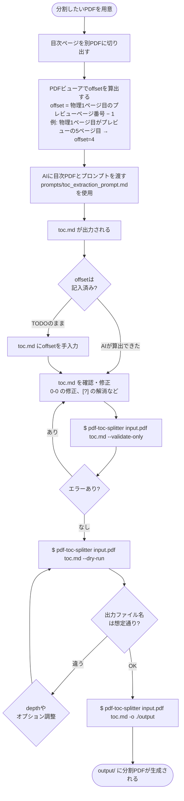

# pdf-toc-splitter

目次Markdownに基づきPDFファイルを章・節単位で分割するCLIツール。

Split PDF files into chapters based on a table-of-contents Markdown file.

## 概要

PDFの目次情報をMarkdownファイルとして与えると、指定した階層深さでPDFを分割します。
目次MarkdownはAI（Claude等）を使って目次ページから生成するか、手動で用意してください。

## インストール

```bash
pip install -e .
```

または `uv` を使用する場合:

```bash
uv sync
```

## 利用の流れ

### 大まかな流れ

大まかに以下の流れで利用する

- 目次のMarkdownを用意する
- 目次に従ってPDFファイルを分割する

### 詳細な流れ



## 目次用意の手順

AIに用意してもらうか、手動で用意する。

### AIに用意してもらう場合

#### Claude Code

ターミナルで Claude Code を起動後、スラッシュコマンドで呼び出す。

```ps
/extract-toc docs/toc-pages.pdf
```

PDF パスを省略して、チャット内で対話的に指定することもできる。

```ps
/extract-toc
```

#### GitHub Copilot Chat（VS Code）

チャットパネルで `#` を入力してプロンプトファイルを選択する。  

```ps
#extract-toc.prompt.md
```

選択後、PDFファイルをチャットにドラッグ＆ドロップして送信する。  
あるいは `#file:` で明示的に指定する。  

```ps
#extract-toc.prompt.md #file:docs/toc-pages.pdf
```

#### AgentにPDF を渡せない場合

エージェントを利用することはできるが、PDF を直接添付できない状況の場合。  
事前に目次ページのテキストをコピーしておき、チャットに貼り付けて使う。  
その場合、プロンプト側に「PDF添付の代わりに以下のテキストを目次として扱ってください」と一言添える。  

### 手動で目次を用意する場合

以下フォーマットを参考に、手動で`toc.md`を作成する。

#### 目次Markdownのフォーマット

以下のようなフォーマットを期待する。

```markdown
# 書籍タイトル（任意）

<!-- offset: 4 -->

- 第1章 はじめに: 1-15
- 第2章 基本概念: 16-42
  - 2.1 定義: 16-25
  - 2.2 分類: 26-42
- 第3章 応用: 43-80
  - 3.1 ケーススタディ: 43-60
    - 3.1.1 事例A: 43-50
    - 3.1.2 事例B: 51-60
  - 3.2 まとめ: 61-80
- 付録A 用語集: 81-90
```

#### 目次の主なルール

- リストマーカーは `-`（ハイフン）
- インデントはスペース2個で1階層（最大3階層）
- 各行の形式: `- {タイトル}: {開始ページ}-{終了ページ}`
- ページ番号は目次に印刷されている番号（PDFプレビューのページ番号ではない）
- `<!-- offset: N -->` でページオフセットを指定（省略時は0）
- `<!-- offset: TODO -->` はAIが算出できなかった場合の暫定値（実分割前に修正が必要）
- `0-0` はページ番号が判読不能だった場合の暫定値（実分割前に修正が必要）

## PDF分割の手順

### 主要オプション

| オプション | デフォルト | 説明 |
| --------- | -------- | ---- |
| `-o`, `--output-dir` | `./output` | 出力ディレクトリ |
| `-d`, `--depth` | `1` | 分割する階層の深さ（1〜3） |
| `--offset` | なし | ページオフセット値（Markdown内の設定より優先） |
| `--dry-run` | — | 分割を実行せずファイル一覧を表示する |
| `--prefix-digits` | `2` | 連番の桁数（全階層共通） |
| `--validate-only` | — | バリデーションのみ実行する |

### 使用例

ルートにて`uv run` + 以下で分割実行する

```bash
# 最上位章のみ分割（デフォルト）
pdf-toc-splitter book.pdf toc.md -o ./chapters

# 節レベルまで分割
pdf-toc-splitter book.pdf toc.md --depth 2 -o ./chapters

# 分割内容を確認してから実行
pdf-toc-splitter book.pdf toc.md --dry-run

# 目次のバリデーションのみ
pdf-toc-splitter book.pdf toc.md --validate-only

# ページオフセットをCLIで指定
pdf-toc-splitter book.pdf toc.md --offset 4
```

### 出力ファイル名の形式

```text
{階層連番}_{タイトル}_p{物理開始ページ}-{物理終了ページ}.pdf
```

例（offset=4、depth=1）:

```text
01_第1章_はじめに_p5-19.pdf
02_第2章_基本概念_p20-46.pdf
03_第3章_応用_p47-84.pdf
```

## ライセンス

MIT License

## 依存関係

- [pypdf](https://github.com/py-pdf/pypdf)
